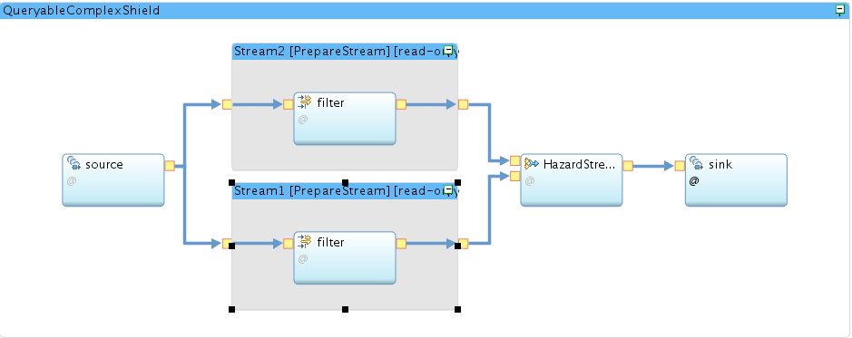

### complex queryable shield

This shield shows how to join two data streams together to support more complex use cases. The shield is also using simple Json queries to filter streams events. The json queries are based on [JsonPath](https://github.com/json-path/JsonPath). To test your json queries, you can use this [website](http://jsonpath.herokuapp.com/). There, you could simply put the event data coming from the sensor in a json format and run the json queries against it.  



## Using shield

This shield expects the following configs:

```json
{
  "stream1Topic": "transformed-events", 
  "stream2Topic": "transformed-events", 
  "actionParams": { 
  },
  "stream1Conditions": [""], 
  "stream2Conditions": [""], 
  "slidingWindowInSeconds": 30 
}
```

- **stream1Topic** : the message hub topic for the first data stream could be `transformed-events` or `value-data`.
- **stream2Topic** : the message hub topic for the second data stream could be `transformed-events` or `value-data`
- **actionParams** : the params needed by the external action, example is show below:

```json
{
  "actionParams": { 
      "hazardTitle":"A hazard was detected.",
      "emailSubject":"Alert from IoT for Insurance",
      "emailText":"Hello IoT for Insurance user. You have a hazard!!!"
   }
}

 ```

- **stream1Conditions** : json queries to apply rules on the first stream.
- **stream2Conditions** : json queries to apply rules on the second stream.
- **slidingWindowInSeconds** : sliding window time in seconds that starts after event from first stream is received. For more information, check IBM streams sliding windows [here](https://developer.ibm.com/streamsdev/2014/08/22/spl-sliding-windows-explained/).


These parameters needs to be provided when submitting/updating the shield code using the [createShieldCode API](https://ioti.us-south.containers.mybluemix.net/docs/#!/shield-codes/createShieldCode) or [updateShieldCode API](https://ioti.us-south.containers.mybluemix.net/docs/#!/shield-codes/updateShieldCode). The parameters are provided as part of the **jobOptions** field like:
 
 ```json
{
   "jobOptions":{
      "config": {
           "stream1Topic": "transformed-events", 
           "stream2Topic": "value-data", 
           "actionParams": { 
           },
           "stream1Conditions": [""], 
           "stream2Conditions": [""], 
           "slidingWindowInSeconds": 30 
       }
   }
}
 ```

## Example

Here are some example of what this shield can do. 

### Severe weather Shield 

The use case for this shield is that it finds out if a door is opened and after some time if a severe weather condition is detected. The contact sensor events will be in the first stream and weather events will be in the second stream. The shield will join both streams based on userId, and locationId (contains zip and country codes) and generate a hazard. The time the shield waits after the contact sensor event arrived to check for severe weather event is configured using the "slidingWindowInSeconds" parameter.

In this example shield we are using wally contact sensor. 

**Wally Contact Sensor normalized event** :

 ```json
{
      "rawEvent": {
          "deviceType": "Wally",
          "id": "2fd2a0b6-e38d-4dda-a315-db51860362aa",
          "snid": "90-7a-f1-00-51-d6-bf-a6",
          "gatewayId": "someVendorId",
          "type": "SENSOR",
          "hwType": 8,
          "data_type": "EVENT",
          "traitStates": {
            "traitStates": {
              "ContactSense": {
                "traitType": "contactSenseTrait",
                "updated": "2017-09-06T00:51:41.325Z",
                "contactDetected": true
              }
            }
          }
    },
    "location": {
       "properties": {
         "zipCode": "62635",
         "countryCode": "US"
       }
     },
    "userId": "testUserId",
    "sensorData": {
        "contactStateOpen": true
    }
  }
```

**Weather event from the value layer** :

 ```json
{
    "metadata": {
      "language": "en-US",
      "transaction_id": "1529391033093:2061268468",
      "version": "1",
      "location_id": "62635:4:US",
      "units": "m",
      "expire_time_gmt": 1529397300,
      "status_code": 200
    },
    "observation": {
      "key": "KAAA",
      "class": "observation",
      "expire_time_gmt": 1529397300,
      "obs_id": "KAAA",
      "obs_name": "Lincoln",
      "valid_time_gmt": 1529390100,
      "day_ind": "N",
      "temp": 45,
      "wx_icon": 33,
      "icon_extd": 3300,
      "wx_phrase": "Fair",
      "pressure_tend": null,
      "pressure_desc": null,
      "dewPt": 23,
      "heat_index": 29,
      "rh": 84,
      "pressure": 992.85,
      "vis": 16,
      "wc": 27,
      "wdir": null,
      "wdir_cardinal": "CALM",
      "gust": null,
      "wspd": 0,
      "max_temp": null,
      "min_temp": null,
      "precip_total": null,
      "precip_hrly": 0,
      "snow_hrly": null,
      "uv_desc": "Low",
      "feels_like": 29,
      "uv_index": 0,
      "qualifier": null,
      "qualifier_svrty": null,
      "blunt_phrase": null,
      "terse_phrase": null,
      "clds": "CLR",
      "water_temp": null,
      "primary_wave_period": null,
      "primary_wave_height": null,
      "primary_swell_period": null,
      "primary_swell_height": null,
      "primary_swell_direction": null,
      "secondary_swell_period": null,
      "secondary_swell_height": null,
      "secondary_swell_direction": null
    }
  }

```


In this case, the shield **jobOptions** will be like:     

 ```json
{
   "jobOptions":{
      "config": {
        "stream1Topic": "transformed-events",
         "stream2Topic": "value-data",
         "actionParams": {
           "hazardTitle": "Hazard detected !"
         },
         "shieldId": "testShieldId",
         "stream1Conditions": ["$.sensorData[?(@.contactStateOpen == true )]"],
         "stream2Conditions": ["$.observation[?(@.temp > 40 )]"],
         "slidingWindowInSeconds": 30
       }
   }
}
