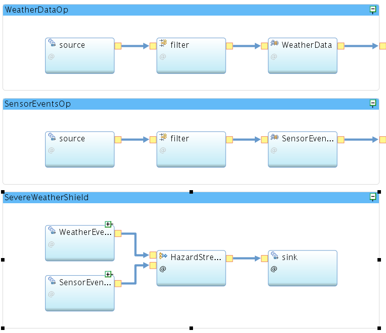

### Severe Weather Shield

This shield can be used for elderly care. The shield generate hazard when the elderly is out of home (identified using a contact sensor in the door) and after some predefined period of time, a severe weather condition was discovered (like high temperature). We use a wally contact sensor to detect if the elderly is out of home and we get weather data from the weather company service in Bluemix. 

The main spl code of this shield is [here](./com.ibm.iot4i.examples/SevereWeatherShield.spl).

This shield follows the [shield template](../../../shield-templates).

The main part of this shield is the below operator:

```
        stream<Hazard> HazardStream = Join(WeatherEventData ; SensorEventData)
   		{
   			window
   				WeatherEventData : sliding, count(0), count(1), partitioned ;
   				SensorEventData : sliding, time(30), count(1), partitioned ;
   			param
   				match : contains(WeatherEventData.WKTLocation, SensorEventData.WKTLocation)
   					&& WeatherEventData.temperature > 42 ;
   				algorithm : inner ;
   				partitionByLHS : WeatherEventData.zipCode ;
   				partitionByRHS : SensorEventData.userId ;
   			output
   				HazardStream : userId = SensorEventData.userId, rawEvents = "[" +
   					SensorEventData.message + "," + WeatherEventData.message + "]",
   					actionParams =
   					"{\"hazardTitle\" : \"A severe weather has been detected.\", \"emailSubject\":\"Alert from IoT for Insurance\", \"emailText\" :\"Hello IoT for Insurance user. You have a hazard!!!\"}" ;
   		}
```

The above operator is based on a [IBM streams join operator](https://www.ibm.com/support/knowledgecenter/en/SSCRJU_4.2.1/com.ibm.streams.toolkits.doc/spldoc/dita/tk$spl/op$spl.relational$Join.html). This operator join the sensor events with the weather data events. It partition the sensor events uing userId to create sub-windows for each user and partition the weather data based on zip code. The two streams are matched together (based on zipCode and temperature) whenever there is a weather event and each sensor event will be evicted from the window after the predefined window (30 seconds in this example). The shield uses some [java helper functions](./impl/java/src/com/ibm/iot4i/examples) to prepare weather and sensor events. The below diagram shows the general view of the shield:



