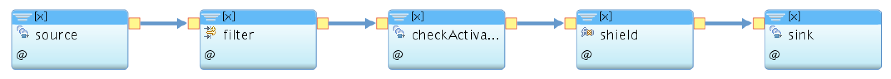

### Shield Template 

This shield template shows the structure of a shield. Any iot4i shield should follow this template. The template contains the following operators:

 
 
 
 1. Annotated Source Operator:
 
 A message hub source operator which abstract the details of connecting to IBM Message Hub. This source operator listens to the annotated events that are generated by the TransformerJob. The output of this operator is `stream<rstring userId, rstring key, rstring message>` where userId is the id of the user who owns the devices which sends the events. The key contains the IBM IoT platform topic. Finally the message is the real event payload.
 
 
 2. Filter Operator:
 
 This is an **optional** operator which can be used to filter events based on any condition that the shield developer wants. It is an entry condition operator to make sure that only valid events are passed into the shield.
 
 
 3. Check Activation Operator:
 
 This is an **Optional** iot4i operator which can be used by shield developer to filter events if the user hasn't activated this shield.  
 
 4. Shield Specific Operator(s):
 
 Here the shield developer can add his shield specific operator(s). The output of his operator(s) should match the hazard schema:

``` 
Type Hazard = rstring userId, list<rstring> rawEvents, rstring actionParams ;
 ```
 Where:
 
 **userId**: The id of the user who owns the device that sends the events. The userId will be provided by the source operator. 
 **rawEvents**: A list of all events that caused the hazard.
 **actionParams**: an object contains all extra information required for the external action.
 
 
 5. SubmitHazards Sink
 
 An iot4i sink operator that prepare hazards and writes them into Message Hub. 
 
 
 
 
 The complete SPl code of the template is [here](./com.ibm.iot4i.shields.templates/ShieldTemplate.spl)