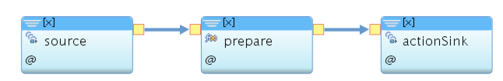

### Action Job


This job listens to all hazards, prepare hazards then calls the create hazard API to create the hazard document and invoke the external action. 

 
 
 
 This job uses the following operator:
 
 [ActionSink](./com.ibm.iot4i.actionjob/ActionSink.spl)
 
 
 Expected Input Hazard Message:
 
```json
 {
 	"userId": "",
 	"actionParams": {},
 	"rawEvents": []
 }
````


